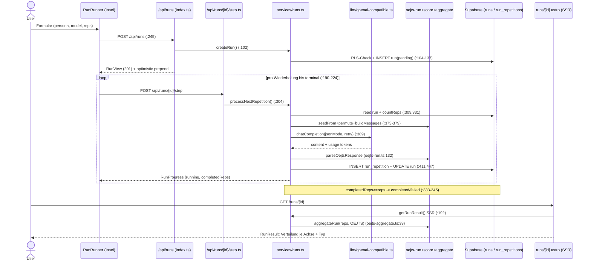

# Research: OEJTS-Mess-/Run-Flow (Deep Focus, M4L3)

**Date**: 2026-06-30T06:22:41+0200
**Researcher**: Damian (via Claude Opus 4.8)
**Git Commit**: 9ad7c4e
**Branch**: main
**Repository**: persona-forge

## Ziel (aus Map gewählt)

**Was:** der OEJTS-Mess-/Run-Flow (Lauf starten → N Wiederholungen gegen ein LLM →
Verteilung/Typ je Achse). **Einstieg:** `src/components/runs/RunRunner.tsx` →
`src/lib/services/runs.ts`. **Warum aus der Map:** `repo-map.md` weist diesen Flow
als **Aktivitäts- und Coupling-Zentrum** aus (`services/runs.ts` Ca 9 +
`instruments/oejts.ts` Ca 7); vom Owner als fachlicher Kern bestätigt
(„die eigentlichen Tests sind das Wichtigste"). Risikozonen-Bezug: `services/runs.ts`,
`api-auth`/`api-responses`, `url-guard` (SSRF). Map-`unknown` als Prior: die
Astro-SSR-Schicht ist für statische Tools unsichtbar.

## Research Question

Wie funktioniert der Run-Flow end-to-end, wo sind die Test-Lücken und wie weit reicht
der Blast-Radius einer Änderung? Drei parallele Sub-Agenten (Trace / Test-Lücken /
Blast-Radius), Map als Prior, Rigor `evidence / inference / unknown`. **Nur Analyse.**

## Summary

Der Flow ist ein **client-getriebener Step-Loop**: die `RunRunner`-Insel ruft pro
Wiederholung **genau einen** `POST /api/runs/[id]/step`, der ganze Zustand liegt in
Supabase (`runs` + `run_repetitions`) — so wird das Cloudflare-Edge-Zeitlimit umgangen,
ohne Queue/Worker. Das Scoring (`oejts-score.ts`) und die Aggregation
(`oejts-aggregate.ts`) sind **reine, solide unit-getestete Logik**; die Ergebnis-Aggregate
werden **nicht persistiert**, sondern bei jedem SSR-Aufruf deterministisch neu berechnet.

Die Map sagte „hier ist das Zentrum" — der Deep Focus zeigt **wo genau es bricht**:

1. **Fachlich:** eine Wiederholung gilt schon bei _einem_ geparsten Item als `ok`
   (`runs.ts:401`), das Scoring verlangt aber _alle 8_ einer Achse (`oejts-score.ts:37`)
   → „ok" und „verwertbar" messen Verschiedenes (stille Semantik-Lücke).
2. **Tests:** die **LLM-Client-Fehlerpfade** (Retry/Backoff/Timeout/jsonMode-Fallback in
   `openai-compatible.ts`) sind **komplett ungetestet** — die gefährlichste Lücke; dazu
   die Status-Finalisierung in `processNextRepetition` und die F3/Target-null-Abbrüche.
3. **Blast-Radius:** ein **Hub um `services/runs.ts`** mit der heißesten Naht zu
   `types.ts` (Entity↔View). Teuerste stille Risiken: der **handgepflegte
   `VIEW_COLUMNS`-String + `toView`-Mapper** und die **ungeprüften `as`-Casts** der Inseln
   über die HTTP-Grenze. Alles an `requireUser`/`json`-Signaturen ist dagegen _billig_
   (Compiler fängt es).

---

## 1. Feature overview

### 1.1 Datenfluss (Phasen, mit file:line)

**Phase A — Lauf anlegen (UI → API → DB)**

1. Client-Validierung: `personaId`/`modelConfigId` gesetzt, `reps` Integer ∈ [1,25]
   (`RunRunner.tsx:232-242`; `MIN/MAX/DEFAULT_REPS` `:30-32`).
2. `POST /api/runs`, Body `{personaId, modelConfigId, instrumentId:"oejts-1.2"(hartkodiert), repetitionCount}` (`RunRunner.tsx:245-249`).
3. Server: `requireUser` → 401 (`index.ts:30`); zod `createSchema` (uuid/uuid, instrumentId 1..120 default, repetitionCount int 1..25) (`index.ts:9-14`).
4. `createRun`: Persona + Modellkonfig **RLS-gescoped** gelesen → `null` falls unsichtbar → Route mappt auf **400** (`runs.ts:104-119`, `index.ts:45`). Insert in `runs` mit `persona_prompt_snapshot` (selbstenthaltener Snapshot), `status` DB-Default `pending` (`runs.ts:121-137`).
5. **201** + optimistisches Listen-Prepend, `progress` lokal mit 0 initialisiert, Step-Loop startet (`RunRunner.tsx:258-270`).

**Phase B — Lauf-Aufteilung (client-getriebener Loop, 1 Rep/Request)** 6. `runStep(runId)` → `POST /api/runs/${id}/step`, plant sich bei nicht-terminalem Status per `setTimeout(…,0)` selbst neu; Abbruch über `cancelledRef`/`timerRef` (`RunRunner.tsx:190-224`). 7. `step.ts` → `processNextRepetition`; `null` → 404 (`step.ts:24-25`). 8. **Zustand aus DB**: `completedReps = countReps()` zählt `run_repetitions`-Zeilen (`runs.ts:268-275,331`); kein In-Memory-State. Terminal → idempotent (`:315-324`); `pending→running` beim ersten Schritt (`:327-329`); alle Reps geschrieben → finalisieren `completed`/`failed` (`:333-345`).

**Phase C — LLM-Call** 9. `repIndex=completedReps+1`; deterministischer Seed `seedFrom(runId,repIndex)` (FNV-1a) → `permuteItems` (Fisher-Yates/mulberry32) → `buildOejtsMessages(snapshot, ordered)` (`runs.ts:373-379`, `oejts-run.ts:34-42`). 10. `chatCompletion`: `POST {baseUrl}/chat/completions`, `response_format:{type:"json_object"}`; **erneuter SSRF-Guard** auf entschlüsselter URL, `redirect:"manual"`, 60-s-Timeout (`openai-compatible.ts:105-132`). Retry `MAX_ATTEMPTS=3`, Backoff `500·2^(n-1)` bei 429/5xx/Netz; jsonMode-Ablehnung → 1× ohne `response_format` (`:136-166`).

**Phase D — Parsen, Scoren (1 Rep), Persistieren** 11. `parseOejtsResponse`: JSON-tolerant (Codefences, `{answers:[]}`, `[{id,value}]`, `{Q1:3}`), sonst Freitext-Regex; Werte via `coerceScale` → Int 1–5 oder `null` (`oejts-run.ts:80-152`). 12. Rep-Status: `okCount===0` → `failed`+`repError`, sonst `ok` (`runs.ts:399-405`). **⚠ Schwelle:** schon **ein** geparstes Item macht die Rep `ok`. 13. Insert `run_repetitions` (`item_order, raw_response, item_values, status, error, tokens`); unique `(run_id,rep_index)` `23505` → tolerant, Fortschritt neu lesen (`runs.ts:411-438`). 14. Lauf-Aggregat: `failed_count += (ok?0:1)`; Token-Summen zählen **alle** verbrauchten Tokens, auch fehlgeschlagene Reps (`runs.ts:444-451`).

**Phase E — Ergebnis (on-the-fly Aggregation, SSR)** 15. `/runs/[id].astro` lädt **server-seitig** `getRunResult` (NICHT über die `/result`-API) und reicht es an `<RunResult client:load>` (`[id].astro:14-25,60`). 16. `getRunResult`: `pending/running` → `unfinished`; sonst alle `item_values` → `aggregateRun(reps, OEJTS)`; `usableReps===0` → `empty`, sonst `ready` (`runs.ts:192-206`). **Aggregate werden nicht persistiert** (deterministisch neu).

### 1.2 Sequenzdiagramm

### 1.3 Scoring-/Aggregations-Mathematik (fachlicher Kern)

**Score je Achse** (`oejts-score.ts:26-46`): `score = constant + Σ(sign·value)` über 8 Achsen-Items.
Konstanten/Cutoffs/Pole (`oejts.ts:27-30`): IE const 30 / SN const 12 / FT const 30 / JP const 18; **alle cutoff 24**; `score>cutoff` → high-Pol. **Achsen-Dropout:** ein `null`-Item → ganze Achse `null` (kein erfundener Wert) (`:35-43`). `deriveType` → `null`, sobald eine Achse `null` (`:53-60`).

**Aggregation über N** (`oejts-aggregate.ts:33-98`): je Achse `mean` (arithmetisch) + `sd` (**Populations-SD ÷n**, SD=0 bei n=1) (`:21-26,52`), `scores[]` (Roh-Verteilung), `letterCounts`. **Modaltyp** = je Achse Mehrheitsbuchstabe, Tie-Break `mean>cutoff?high:low` (`:69-82`). **Typ-Konsistenz** = Anteil der Reps mit _vollständigem_ Typ, die exakt `modalType` ergeben (`:85-92`). `usableReps` = Reps, die zu ≥1 Achse beitrugen (`:95`).

### 1.4 Was die Map NICHT zeigte (Mehrwert des Deep Focus)

- **Ordner-Tiefe ≠ Logik-Tiefe:** Die scheinbar dicke Schichtung ist real ein **Hub in `services/runs.ts`** (461 Z) plus dünne reine Module — das Gewicht liegt an einer Stelle.
- **„Eine Wiederholung" ist Fassade über DB-Zustand**: die Aufteilung ist ein _client-getriebener_ Loop, nicht Queue/Worker; Resume ergibt sich aus dem `run_repetitions`-Count.
- **Ergebnis ist berechnet, nicht gespeichert** — jede Ergebnis-Ansicht re-aggregiert.
- **Anzeige ist optimistisch beim Start, danach server-bestätigt** (jeder `RunProgress` überschreibt lokal; `refetch()` nach Terminal) (`RunRunner.tsx:211-218`).

---

## 2. Technical debt

> Karte der **Fragilität**, nicht der „hässlichen Dateien": wo eine Änderung still
> Daten/Kontrakt brechen kann, wo das Sicherheitsnetz fehlt, und wo Risiko nur
> _scheinbar_ ist (Compiler/CI fängt es).

### 2.1 Fachliche Korrektheits-Risiken (stille Semantik)

| #   | Risiko                                                                                                                                                                                                                                                                 | Beleg                                   | Klasse               |
| --- | ---------------------------------------------------------------------------------------------------------------------------------------------------------------------------------------------------------------------------------------------------------------------- | --------------------------------------- | -------------------- |
| D1  | **„ok"-Schwelle ≠ „verwertbar".** Rep gilt bei `okCount≥1` als `ok` (zählt nicht zu `failed_count`), Scoring braucht aber alle 8 Items je Achse. Eine `ok`-Rep kann zu _keiner_ Achse beitragen → senkt Fehlquote, erhöht `usableReps` nicht.                          | `runs.ts:401` vs `oejts-score.ts:37-41` | **echt** (inference) |
| D2  | **Zwei Mehrheitsbegriffe.** `modalType` achsenweise aus `letterCounts`; Typ-Konsistenz gegen _vollständige_ Per-Rep-Typen. Der zusammengesetzte `modalType` muss nicht der häufigste Einzeltyp sein (ökolog. Aggregation). Dokumentiert, aber interpretationsrelevant. | `oejts-aggregate.ts:75-90`              | echt, bewusst        |
| D3  | **Populations-SD (÷n)** unterschätzt Streuung bei kleinem N ggü. Stichproben-SD. Vertretbar (Reps = Vollerhebung des Laufs), aber erwähnenswert.                                                                                                                       | `oejts-aggregate.ts:21`                 | bewusst              |

### 2.2 Test-Lücken (Sicherheitsnetz)

**Solide gedeckt (evidence):** die gesamte reine Kette `oejts-run/score/aggregate` inkl.
aller Edge-Cases — leere/teilweise Antwort, Out-of-Range, Cutoff-Grenzwerte 24/25,
Dropout, 0-verwertbar (Division-Guard), N=1 vs N>1 (`oejts-run.test.ts`,
`oejts-score.test.ts:15-66`, `oejts-aggregate.test.ts:28-78`). Orchestrierung punktuell
itest-gedeckt: Abort/Cascade, Idempotenz, **F4-Nebenläufigkeit (23505)**, SSRF-Guard,
3xx-Block, Happy-Path (`run-integrity.itest.ts:60-162`, `ssrf-boundary.itest.ts:111-142`).

**Gefährlichste Lücken (Rangliste):**

1. **LLM-Client-Fehlerpfade komplett ungetestet** (`openai-compatible.ts`): 429/5xx-Retry,
   Backoff, **Timeout/AbortController**, jsonMode-400/422-Fallback, non-JSON, leerer
   Content — kein `*.test.ts` für die Datei. Breit genutzte Netzlogik mit 3-Attempt-Verzweigung;
   ein Regress („Retry greift nie", „Timeout bricht nicht ab") wäre still. _(evidence)_
2. **`processNextRepetition`-Statusmaschine**: `pending→running` (`runs.ts:327`),
   Finalisierung `completedReps≥count→completed` (`:334`) und **`failedCount≥count→failed`**
   (`:335`) nie über die echte Orchestrierung gefahren — `makeFailedRun` setzt Status direkt
   (`fixtures.ts:164`) und umgeht genau diese Logik. Off-by-one bliebe unentdeckt. _(evidence)_
3. **„200 + unbrauchbarer Inhalt" → still `failed` persistiert** (`runs.ts:401`): okCount-0 ist
   unit-getestet, der Persistenz-Pfad nicht (LLM verweigert höflich / liefert Prosa). _(inference)_
4. **F3 / fehlende Modellkonfig → ganzer Lauf `failed`** (`runs.ts:348,360`): beide „kein
   Target"-Abbrüche ungetestet. _(evidence)_
5. **API-Route-Handler `runs/*` nie über HTTP-Context getestet** (zod, 400/404, `requireUser`)
   — `makeApiContext` existiert, wird aber nur für `test-connection` genutzt. _(evidence)_
6. **Token-Akkumulation** (`runs.ts:444`) ohne Assertion → Verbrauchs-Reporting (FR-015) könnte
   still falsch zählen. _(inference)_

### 2.3 Blast-Radius / Fragilitäts-Naht

Der Flow ist ein **Hub um `services/runs.ts`** (in allen 6 Run-Commits berührt). Heißestes
Paar: `services/runs.ts ↔ types.ts` (×3 co-changed, Fenster 2026-06-18…21).

**Echte stille Risiken** (nichts erzwingt Synchronität):

| Naht                                        | Warum echt                                                                                                                               | Beleg                                                                    | Connascence                                  |
| ------------------------------------------- | ---------------------------------------------------------------------------------------------------------------------------------------- | ------------------------------------------------------------------------ | -------------------------------------------- |
| **`VIEW_COLUMNS`-String + `toView`-Mapper** | Spalten von Hand gespiegelt; `VIEW_COLUMNS` ist ein **String-Literal, kein Typ** — falscher Spaltenname = Runtime-Fehler, Compiler blind | `runs.ts:39,59-76`                                                       | Position/Name, statisch-unsichtbar           |
| **`as`-Casts der Inseln über HTTP**         | `as RunView[]/RunProgress/RunView` ohne Runtime-Validator; Server-Drift bleibt TS-grün, bricht im Browser                                | `RunRunner.tsx:180,211,258`; `RunResult/RunComparison` via `import type` | Name+Type, **dynamisch** über Serialisierung |
| **Constraints 3-fach dupliziert**           | `repetition_count 1..25`, `instrument_id` default, status-Enums leben in **SQL + zod + TS** und divergieren still                        | `runs.sql:24-26,62` vs `index.ts:12-13` vs `types.ts:194-197`            | Bedeutung, mehrere Orte                      |
| **Fehler-_Form_ `{error}`**                 | Inseln parsen `error`-Feld; Form-Wechsel (`{error}`→`{message}`) ohne Compiler-Alarm                                                     | `api-responses.ts:20`                                                    | Bedeutung, dynamisch                         |

**Billige (mechanische) Kopplung** — Compiler/CI fängt sie sofort: `requireUser`-Rückgabe-Shape
(`api-auth.ts:22`, Ca=10), `json/jsonError`-Signaturen (`api-responses.ts:8-17`, Ca≈11), die
reinen Logik-Module (`oejts*.ts`, typisiert + unit-getestet). **Nicht** mit echtem Schuldenrisiko
verwechseln.

**Schema-Änderung wandert mit nach:** Migration → `Run`/`RunRepetition` (types) →
`VIEW_COLUMNS`-String + `RunViewRow`-Pick + `toView` → ggf. `RunView` + Inseln →
Integration-Tests (`rls-cross-tenant.itest.ts`, `run-integrity.itest.ts`, `fixtures.ts`).

### 2.4 ast-grep-Verifikation der strukturellen Behauptungen

Strukturelle Claims (Zahlen, „alle/nur", Call-Sites) mit `ast-grep` geprüft; jedes
Null per `grep` gegengeprüft (Lektionsregel: Null ≠ Fehlen, oft Pattern-Fehler).

| Behauptung                                                 | Methode                                                                     | Ergebnis                                               | Beleg                                                                             |
| ---------------------------------------------------------- | --------------------------------------------------------------------------- | ------------------------------------------------------ | --------------------------------------------------------------------------------- |
| 8 Items je Achse, 32 total, jedes mit `sign ±1`            | grep (ast-grep `sign: $S` gab **0 → Pattern-Artefakt**, per grep widerlegt) | **bestätigt**                                          | `oejts.ts:33-` (8× IE/SN/FT/JP; 32× `sign`)                                       |
| Alle Achsen `cutoff: 24` (const 30/12/30/18)               | grep                                                                        | **bestätigt**                                          | `oejts.ts:27-30`                                                                  |
| `MAX_ATTEMPTS=3`, Backoff `500·2^(n-1)`, Retry bei 429/5xx | grep                                                                        | **bestätigt**                                          | `openai-compatible.ts:22,85,158-162`                                              |
| `requireUser` gatet alle 4 Run-Routes                      | ast-grep `requireUser($$$)`                                                 | **bestätigt** (4 Dateien; `[id].ts` 2× für GET+DELETE) | `step.ts:17`, `index.ts:30`, `[id].ts:35,62`, `result.ts:16`                      |
| Ungeprüfte `as Run*`-Casts über HTTP-Grenze                | ast-grep 3 Patterns + grep                                                  | **bestätigt + präzisiert**                             | nur `RunRunner.tsx:180` (`RunView[]`), `:211` (`RunProgress`), `:258` (`RunView`) |

**Präzisierung (verschärft den Blast-Radius-Befund §2.3):** die ungeprüfte Laufzeit-Naht
ist **auf `RunRunner.tsx` konzentriert** — die einzige Insel, die selbst `fetch`+`as` macht.
`RunResult`/`RunComparison` erhalten ihre Daten als SSR-**Props** (`[id].astro` re-aggregiert
server-seitig), casten also nicht. → Ein Runtime-Validator (zod) an genau 3 Stellen einer
Datei würde die gesamte dynamische Naht schließen. Damit ist das _inference_-Label von D-Risiken
in §2.3 für die Casts zu **evidence** geschärft.

---

## Code References

- `src/components/runs/RunRunner.tsx:190-270` — Step-Loop + optimistisches Prepend
- `src/pages/api/runs/index.ts:9-46` — zod-Schema + createRun-Route (201/400/401)
- `src/pages/api/runs/[id]/step.ts:11-25` — eine Rep pro Request, 404-Mapping
- `src/lib/services/runs.ts:102-137` createRun · `:192-206` getRunResult · `:255-460` processNextRepetition · `:39,59-76` VIEW_COLUMNS + toView
- `src/lib/instruments/oejts.ts:16-30` — Items, Konstanten, Cutoffs, Pole
- `src/lib/runs/oejts-score.ts:26-81` — Scoring + axisScale · `oejts-aggregate.ts:21-98` — Aggregation/Modaltyp/Konsistenz · `oejts-run.ts:34-152` — permute/build/parse
- `src/lib/llm/openai-compatible.ts:105-189` — LLM-Call, SSRF-Guard, Retry/Backoff/Timeout
- `src/pages/runs/[id].astro:14-25` — SSR-Aggregation (nicht über /result-API)
- `supabase/migrations/20260617190000_runs.sql:17-69` — runs + run_repetitions, RLS, Constraints

## Architecture Insights

- **Edge-Limit-Umgehung ohne Queue:** client-getriebener 1-Rep-Loop + DB-Zustand statt
  Worker/Queue — pragmatische Antwort auf das Cloudflare-Gotcha (CLAUDE.md). Trade-off:
  Fortschritt hängt am laufenden Browser-Tab (kein Server-Resume-Trigger).
- **Determinismus:** Seed pro `(runId, repIndex)` → reproduzierbare Item-Permutation;
  Ergebnis wird re-aggregiert statt gespeichert → eine Quelle der Wahrheit (DB-Reps).
- **Sicherheit serienmäßig:** SSRF-Guard doppelt (Guard + erneut auf entschlüsselter URL),
  `redirect:manual`, RLS auf beiden Tabellen.
- **Fragiler Kern = die Hand-gepflegte Entity↔View-Grenze**, nicht die Test-Logik.

## Historical Context (from prior changes)

- `context/archive/2026-06-17-oejts-measurement-run/` — Genesis des Flows (Commit 6e396ec:
  oejts.ts + types.ts + runs.ts + Migration gemeinsam).
- `context/archive/2026-06-18-distribution-results/` — Aggregation/Verteilung (17dfcb3).
- `context/archive/2026-06-20-run-control-and-tokens/` — Step-Loop/Token (614b4ea).
- `context/archive/2026-06-21-side-by-side-comparison/` — RunComparison.
- `context/foundation/lessons.md` — Astro-Insel-Hydration-Lektion betrifft `RunComparison`.
- F3/F4-Marker in `runs.ts:298-302` referenzieren einen Plan-Review der `model-config`-/
  `run-integrity`-Changes (Plan-Docs nicht gelesen).

## Open Questions (unknowns)

- Konkreter `RELIABLE_MIN`-Wert + `axis-chart.tsx`-Rendering (Datei nicht gelesen).
- Ob die Inseln die JSON-Antworten _irgendwo_ doch runtime-validieren (in gegrepten Stellen nicht gesehen).
- Ob `/api/runs/[id]/result` (auth-getestet, aber UI nutzt SSR) für künftiges Polling/Vergleich gedacht ist.
- `getDecryptedTarget`/`crypto.ts`-Interna (nur als Aufruf gesehen).
- Co-Change-Belege nur im 4-Tage-Fenster (S-04…S-07) — keine Aussage über künftige Kopplung.
- Ob `coerceScale`-Rundung (3.4→3) und ein „Resume nach N Schritten bis completed"-Pfad
  bewusst ungetestet bleiben.

## Verifikations-Status

**ast-grep-Verifikation abgeschlossen** (§2.4, M4L3 Schritt 3). Fünf strukturelle Kern-Claims
geprüft, alle **bestätigt**; ein ast-grep-Null (`sign: $S`) als Pattern-Artefakt per grep
entlarvt (echtes Fehlen ausgeschlossen). Die `as`-Cast-Naht wurde dabei von _inference_ zu
_evidence_ geschärft und auf `RunRunner.tsx` lokalisiert. Verbleibende _inference_-Aussagen
(D1 Semantik-Lücke, Test-Lücken 3 & 6) sind Pfad-Schlüsse ohne ausführbaren Gegentest — bewusst
nicht weiter „verifiziert", da sie Verhaltens-, keine Struktur-Behauptungen sind.

**Status:** Deep-Focus-Evidenz vollständig. **Kein Refaktor** (M4L3 Schritt 4 = Stop). Dieser
Report ist Input für M4L4 (Refaktor-Plan): Kandidaten u. a. D1 („ok"-Schwelle), LLM-Client-Tests,
zod-Validator an der RunRunner-Naht, Constraint-Single-Source (`1..25`/Enums).
