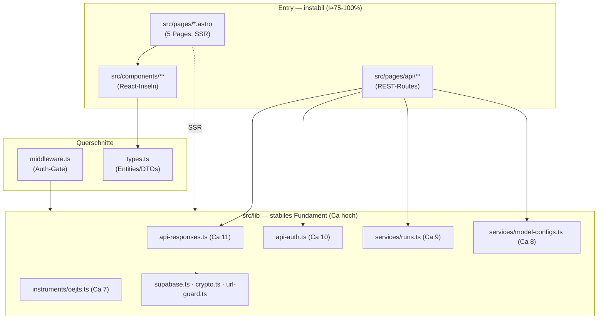

# Projekt-Map — persona-forge

> Onboarding-Map (s04e02, L2). Synthese aus `artifact-1-territory.md` (Git-Aktivität),
> `artifact-2-structure.md` (Import-Graph) und `artifact-3-contributors.md` (Kontext-Spur).
> Decyzyjny, dowodowy — kein vollständiger Repo-Beschrieb. Ziel: nach 15 min weißt du,
> wo Dinge leben, was gefährlich ist und wo du anfängst.

## 1. TL;DR

persona-forge ist ein **Astro-6-SSR-Tool für psychometrisches LLM-Profiling**:
es fährt gemeinfreie Tests (v1: OEJTS) mit N Wiederholungen gegen LLMs und liefert
Verteilungen je Achse. Drei Schichten: **Astro-Pages/API-Routes** (Entry) →
**React-Inseln** (interaktive UI) → **`src/lib/`** (Business-Logik, stabiles Fundament),
mit **Supabase** (Postgres/Auth) und Deploy auf **Cloudflare Workers**. Die Arbeit
konzentriert sich klar auf den **Mess-/Run-Flow** (`services/runs` + `instruments/oejts`

- Run-Inseln) — das ist Aktivitäts-Hotspot _und_ struktureller Blast-Radius-Kern.
  Querschnitte mit hohem Risiko: **Auth** (`middleware` + `api-auth`) und
  **verschlüsselte LLM-Keys** (`model-configs` + `crypto`). Es gibt **keine Import-Zyklen**
  und **keine toten Module**. Größter blinder Fleck der Map: die **Astro-Routing-Schicht**
  ist für statische Tools unsichtbar.

## 2. Terrain — Verantwortung vs. Peripherie

- **Tiefer Kern (hohe Verantwortung):** `src/lib/` — besonders `services/runs.ts`,
  `instruments/oejts.ts`, `lib/runs/oejts-aggregate.ts` (Mess-Flow) sowie die
  Quer-Kontrakte `api-responses.ts` + `api-auth.ts`. Größte Code-Aktivität _und_
  größter afferenter Coupling.
- **Volatile Oberfläche:** `src/pages` (54 Changes) + `src/components` (53) — Routen
  und Inseln, reine Konsumenten. Ändern sich oft, brechen aber wenig anderes.
- **Aktivität in der Zeit:** 172 Commits / 20 Tage / ein Autor → alles „jung".
  _Stabil-vs-eingefroren ist NICHT ableitbar_ (Methodengrenze, siehe §7).

## 3. Reale Verbindungen (was hängt wirklich zusammen)

- **Vertikale Slices** (aus Co-Changes): jedes Feature bewegt `lib` + `pages` +
  `components` gemeinsam — gesundes Muster, kein Cross-Layer-Leck.
- **Blast-Radius-Kontrakte** (aus Graph): `api-responses.ts` (11 Importeure) und
  `api-auth.ts` (10) berühren faktisch jede API-Route → eine Änderung dort strahlt breit.
- **Kein Zyklus**, **kein Orphan** — die „Orphans" `types.ts`/`config-status.ts` sind
  Werkzeug-Artefakte (type-only / Astro-Import), kein toter Code.

## 4. Risikozonen

| Zone                                              | Warum riskant                                                       | Quelle                    |
| ------------------------------------------------- | ------------------------------------------------------------------- | ------------------------- |
| **`middleware.ts`**                               | Auth-Gate je Request; Bug = Auth-Lücke auf allen geschützten Routen | Git-Hotspot + Querschnitt |
| **`lib/api-auth.ts`**                             | 10 Routes hängen dran; Sicherheits-Kontrakt                         | Graph (Ca 10)             |
| **`lib/services/model-configs.ts` + `crypto.ts`** | verschlüsselte LLM-Keys; Fehler = Key-Leak                          | Hotspot + Domäne          |
| **`lib/url-guard.ts`**                            | SSRF-Schutz für ausgehende LLM-Calls                                | Graph + Security-Changes  |
| **`lib/services/runs.ts`**                        | Kern-Domäne, breit importiert, Supabase+LLM-gekoppelt               | Hotspot + Graph (Ca 9)    |
| **`lib/api-responses.ts`**                        | 11 Importeure; Form-Änderung bricht jede Route                      | Graph (Ca 11)             |

## 5. Wen fragen

**n.a. — Solo-Repo.** Ersatz = dokumentierte Kontext-Spur: je Bereich liegt ein
archivierter Change unter `context/archive/` mit `change.md`+`plan.md` (siehe
`artifact-3-contributors.md` für die Bereich→Change-Tabelle). Projektweit:
`context/foundation/{prd,roadmap,test-plan}.md` + `CLAUDE.md` (Gotchas/Conventions).

## 6. Erster Tag — 5–8 Dateien zum Einlesen

1. `CLAUDE.md` — Conventions + Gotchas (Cloudflare/Supabase/E2E/Tokens)
2. `src/types.ts` — Entities/DTOs, das gemeinsame Vokabular
3. `src/middleware.ts` — Auth-Gate + `context.locals.user`
4. `src/lib/instruments/oejts.ts` — **das Instrument** (Items/Achsen/Scoring)
5. `src/lib/services/runs.ts` — Kern-Domäne: Messlauf-Orchestrierung
6. `src/lib/runs/oejts-aggregate.ts` — Verteilungs-/Aggregations-Logik
7. `src/components/runs/RunRunner.tsx` → `RunResult.tsx` — der UI-Pfad des Flows
8. `src/lib/api-auth.ts` + `api-responses.ts` — die API-Quer-Kontrakte

## 7. Grenzen — was diese Map NICHT sagt

- **Zeitfenster:** 20 Tage, ein Autor → keine Aussage über stabile vs. tote Pfade,
  keine saisonalen Trends, keine Wissensstreuung.
- **Astro-Schicht unsichtbar:** statischer Graph deckt nur `.ts`/`.tsx` (68 Module);
  alle `.astro`-Page→Insel- und Page/Layout→Service-Importe **fehlen**. Größter unknown.
- **`import type` + Runtime-Bindungen** (Middleware-Dispatch, `astro:env`-Injektion,
  `prerender=false`-Datenladen) liegen außerhalb statischer Analyse.
- Map = **Aktivität + Struktur**, keine Qualitäts- oder Korrektheitsaussage je Modul.
